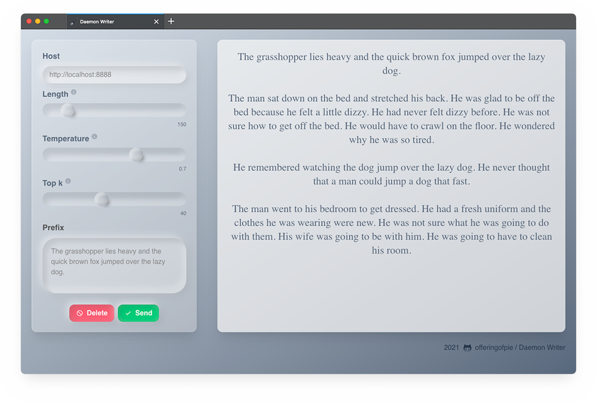

# Daemon Writer
Front-end to send and receive requests with a [GPT-2 Cloud Run](https://github.com/minimaxir/gpt-2-cloud-run) server.

  

## Why?!
I wanted to learn how easy it would be to use [tailwindcss](https://tailwindcss.com/) and adapt it to have [Neumorphism](https://css-tricks.com/neumorphism-and-css/)/[Glassmorphism](https://uxdesign.cc/glassmorphism-in-user-interfaces-1f39bb1308c9)-ish design, so why not?

## Built With
- [React](https://reactjs.org/)
- [react-snap](https://github.com/stereobooster/react-snap) (for pre-rendering)
- [Tailwind CSS](https://tailwindcss.com/)
- [CRACO](https://www.npmjs.com/package/@craco/craco) (Create React App Configuration Override)
- [Docker](https://www.docker.com) (optional)

## Run in Docker
First, build the image: `docker build -t daemon-writer .`

Then run it: `docker run -p <AVAILABLE PORT>:80 -dit daemon-writer`

